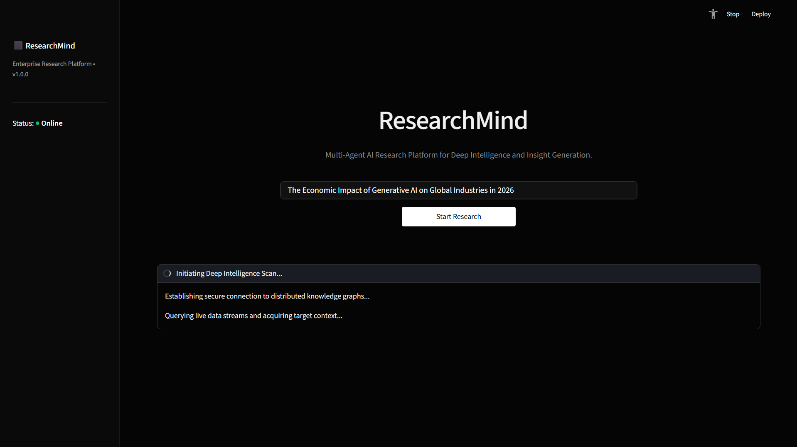
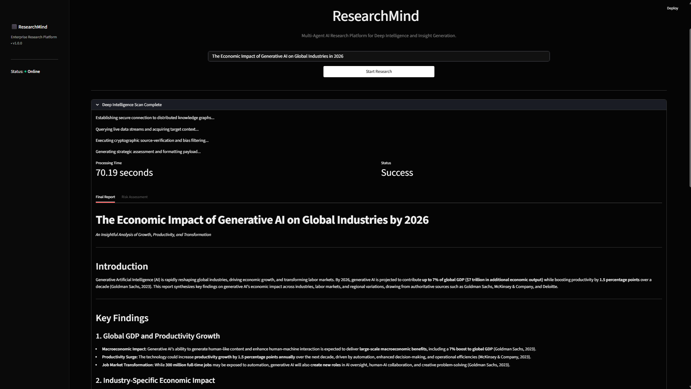
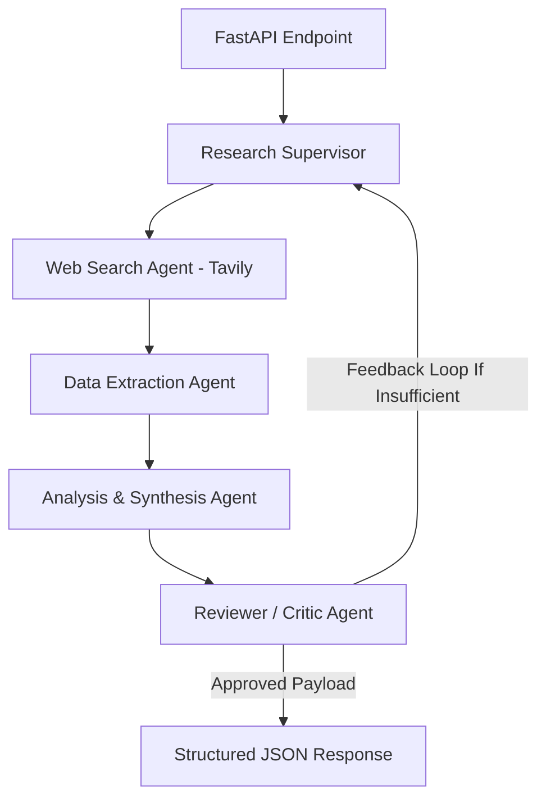

# ⬛ ResearchMind

### Enterprise Multi-Agent AI Research Platform for Deep Intelligence and Insight Generation

Detailed, cryptographic source-verified intelligence scans powered by decoupled microservice architectures.

---

## 📖 Table of Contents

* [✨ Core Features](#-core-features)
* [🎯 Why ResearchMind?](#-why-researchmind)
* [🏗️ System Architecture](#️-system-architecture)
* [📂 Project Structure](#-project-structure)
* [🧠 Multi-Agent Orchestration](#-multi-agent-orchestration)
* [🚀 Quick Start](#-quick-start)

  * [Prerequisites](#prerequisites)
  * [Local Development Setup](#local-development-setup)
  * [Docker Compose Deployment (Recommended)](#docker-compose-deployment-recommended)
* [🌐 Cloud Deployment (AWS EC2)](#-cloud-deployment-aws-ec2)
* [🔒 Environment Configuration](#-environment-configuration)
* [📊 Production Observability & Logs](#-production-observability--logs)

---

## ✨ Core Features

* **Multi-Agent Swarm Integration:** Orchestrates complex reasoning patterns using collaborative AI agents powered by Mistral AI.
* **Live Knowledge Graph Queries:** Utilizes Tavily AI APIs for real-time Web Intelligence and search optimization.
* **Decoupled Cloud Architecture:** Highly-optimized standalone FastAPI backend interacting with an ultra-responsive, beautiful custom Streamlit frontend dashboard.
* **Production-Grade Containerization:** Multi-stage Docker builds configured to communicate safely across isolated Docker bridge networks.
* **Comprehensive Risk Appraisals:** Generates separate structured Markdown outputs for deep analytical insights and adjacent risk assessments/critiques.

---

## 🎯 Why ResearchMind?

Traditional single-prompt LLM interactions fail when tasked with executing extensive market research or strategic intelligence gathering. They lack iterative verification mechanisms and real-time validation.

ResearchMind addresses this by treating research as a multi-stage software engineering pipeline:

1. **Context Acquisition:** Breaking down complex queries into parallel search paradigms.
2. **Bias Filtering:** Re-evaluating text resources through specialized AI agents to filter out noise and promotional content.
3. **Payload Generation:** Synthesizing disparate data points into cohesive, analytical enterprise documentation.

---

## 📸 Screenshots

### Dashboard



### Research Results




---

## 🏗️ System Architecture

ResearchMind is engineered as a decoupled microservices platform. The frontend and backend run in completely isolated container environments, ensuring high scalability and fault tolerance.

```text
+-------------------------------------------------+
|               User Web Browser                  |
+-----------------------+-------------------------+
                        |
                 Port 8501 (HTTP)
                        |
                        v
+-----------------------+-------------------------+
|             Streamlit UI Container              |
|               (researchmind-ui)                 |
+-----------------------+-------------------------+
                        |
                 Internal Network
               (http://api:8000/api/research)
                        |
                        v
+-----------------------+-------------------------+
|             FastAPI Backend Engine              |
|               (researchmind-api)                |
+-------------------+---------------+-------------+
                    |               |
        Outbound SSL|               |Outbound SSL
                    v               v
     +--------------+---+       +---+--------------+
     |    Mistral AI    |       |    Tavily AI     |
     |   (Inference)    |       |   (Web Search)   |
     +------------------+       +------------------+

---

## 🧠 Multi-Agent Orchestration



### The Supervisor

Parses user queries into actionable micro-tasks and updates system routing parameters.

### The Search & Extraction Team

Performs live contextual lookup, sanitizes incoming DOM hierarchies, and strips tracker nodes.

### The Critic

Validates facts, identifies logical gaps, and populates the dedicated Risk Assessment module.

---

# 🚀 Quick Start

## Prerequisites

* Python 3.10 or higher installed locally
* Docker and Docker Compose installed
* API Keys for Mistral AI and Tavily AI

## Local Development Setup

### Clone the Repository

```bash
git clone https://github.com/dpk516/researchmind.git
cd researchmind
```

### Configure Environment Variables

Create a `.env` file in the root directory:

```env
MISTRAL_API_KEY=your_actual_mistral_key_without_quotes
TAVILY_API_KEY=your_actual_tavily_key_without_quotes
```

### Run the Backend (FastAPI)

```bash
cd backend

python -m venv venv

# Linux / macOS
source venv/bin/activate

# Windows
venv\Scripts\activate

pip install -r requirements.txt

uvicorn main:app --reload --port 8000
```

### Run the Frontend (Streamlit)

Open a new terminal:

```bash
cd frontend

python -m venv venv

# Linux / macOS
source venv/bin/activate

# Windows
venv\Scripts\activate

pip install -r requirements.txt

export API_URL=http://127.0.0.1:8000/api/research
# Windows:
# set API_URL=http://127.0.0.1:8000/api/research

streamlit run streamlit_app.py --server.port 8501
```

---

## Docker Compose Deployment (Recommended)

```bash
docker-compose up -d --build
```

Access the application at:

```text
http://localhost:8501
```

---

# 🌐 Cloud Deployment (AWS EC2)

ResearchMind is optimized for deployment on Linux cloud instances such as Ubuntu EC2 instances.

### Create Docker Network

```bash
docker network create research-net
```

### Deploy Backend

```bash
docker run -d \
  --name api \
  --network research-net \
  -p 8000:8000 \
  --env-file .env \
  dpk516/researchmind-api:v1
```

### Deploy Frontend

```bash
docker run -d \
  --name ui \
  --network research-net \
  -p 8501:8501 \
  -e API_URL=http://api:8000/api/research \
  dpk516/researchmind-ui:v1
```

---

# 🔒 Environment Configuration

| Key             | Expected Format   | Scope              | Description                                 |
| --------------- | ----------------- | ------------------ | ------------------------------------------- |
| MISTRAL_API_KEY | Plain text string | Backend Container  | Authenticates runtime LLM payload routing   |
| TAVILY_API_KEY  | Plain text string | Backend Container  | Authorizes secure web intelligence searches |
| API_URL         | Valid URI         | Frontend Container | Points Streamlit requests to the API        |

> ⚠️ **Warning**
>
> Passing environment variables with quotes (e.g., `MISTRAL_API_KEY="xyz123"`) may cause authentication failures and 401 Unauthorized responses from provider APIs.

---

# 📊 Production Observability & Logs

ResearchMind follows cloud-native Twelve-Factor App principles by streaming logs directly to stdout.

### Live Backend Logs

```bash
docker logs -f api
```

### Recent Backend Logs

```bash
docker logs --tail 100 api
```

### Frontend Logs

```bash
docker logs ui
```

---

